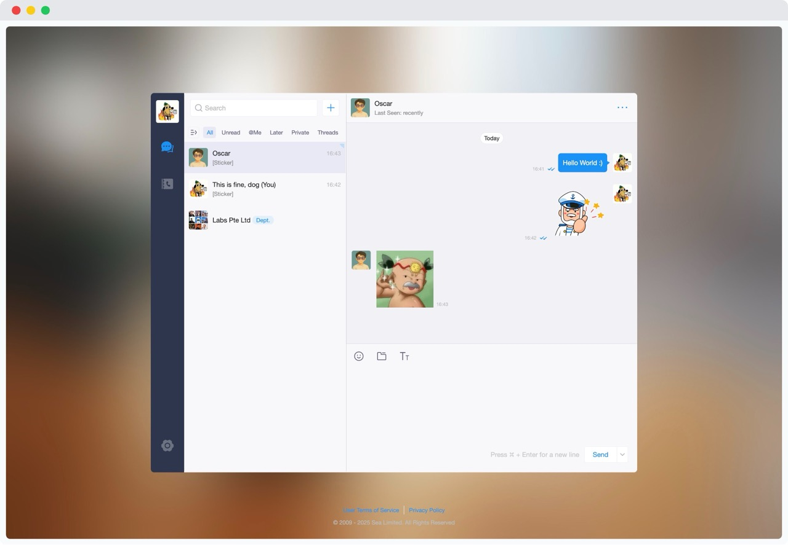
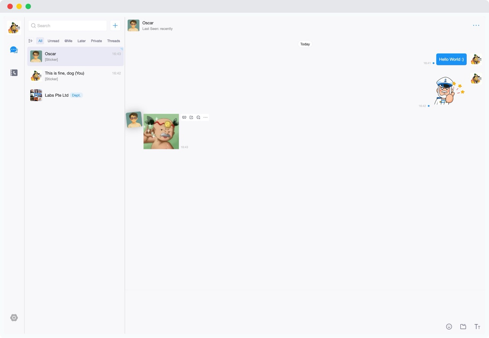

# 🐢 Sea Turtle

**Upgrade your SeaTalk web experience** with a sleek, modern, and more productive UI.

## 🚀 Features

- 🎨 **Custom CSS Injection**
  Injects a refined style sheet to improve font spacing, colors, borders, and layout across the SeaTalk web interface.

- 🖥️ **Fullscreen Chat Mode**
  Removes the default background and expands the chat window to use the full screen — minimal distraction, maximum focus.

- 🧼 **Modern UI Redesign**
  A clean, elegant rework of SeaTalk’s web client: better contrast, improved message bubbles, polished icons, and intuitive spacing.

## 📸 Preview

| Before                                 | After                                |
| -------------------------------------- | ------------------------------------ |
|  |  |

## 🧩 Installation

1. Clone or download this repo.
2. Open Chrome and navigate to `chrome://extensions/`
3. Enable **Developer Mode** (top right).
4. Click **Load unpacked** and select the extension directory.

## 🔧 Development

All CSS changes are injected via `content_script`. You can update `styles.css` to customize your theme.

## 📄 License

MIT License
